

  
     
  <h1 align="Center">Bixby Views</h1>

## Usage

| nl(Show an image card) | nl(Show a thumbnail card) | nl(Show a compound card) | nl(Show an image carousel) |
| --- | --- | --- | --- |
| 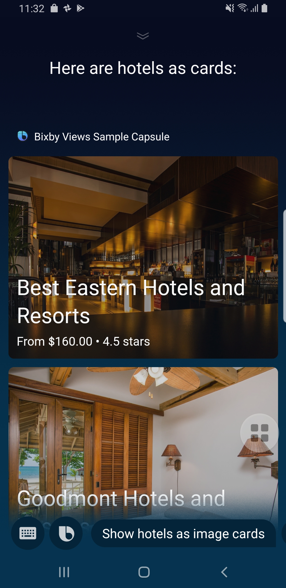 | 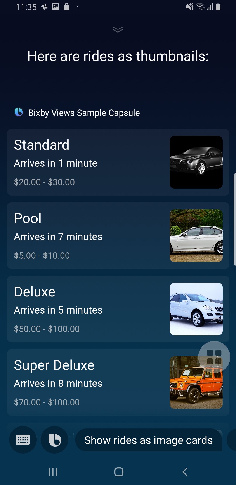 | 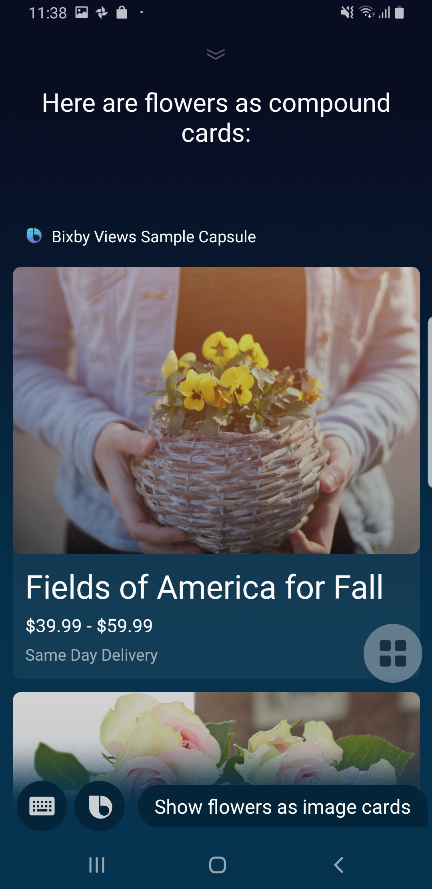 | 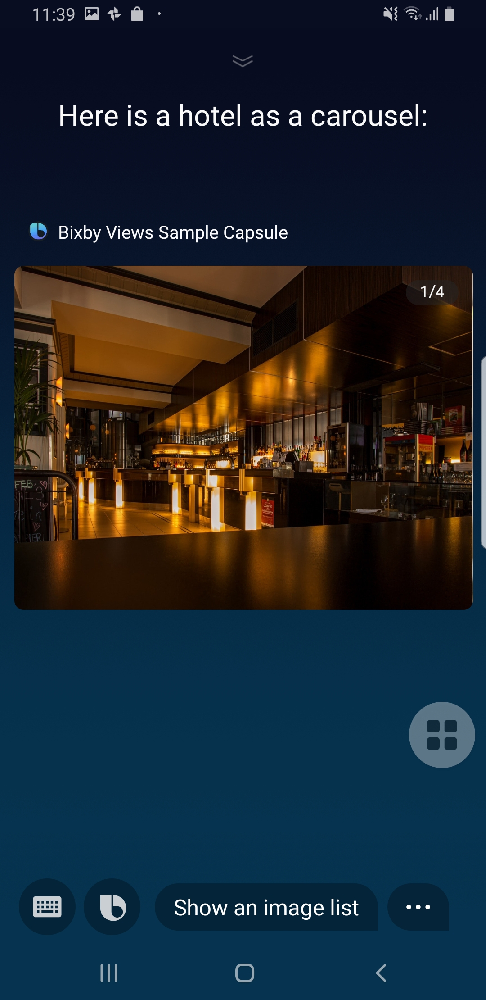 |

| nl(Show an image list) | nl(Show a cell area) | nl(Show a cell card) | nl(Show an input cell) |
| --- | --- | --- | --- |
 | 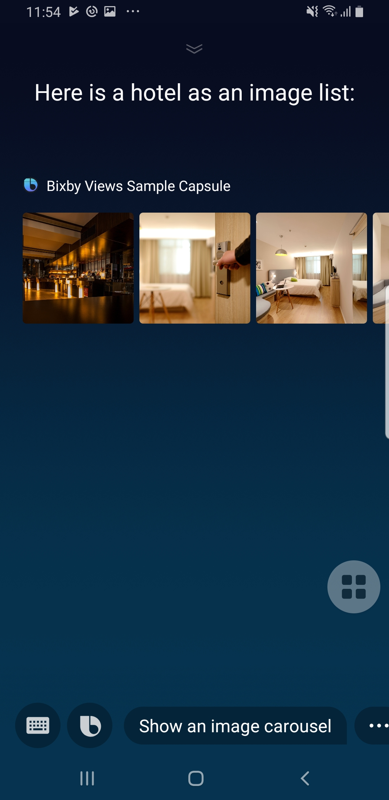 | 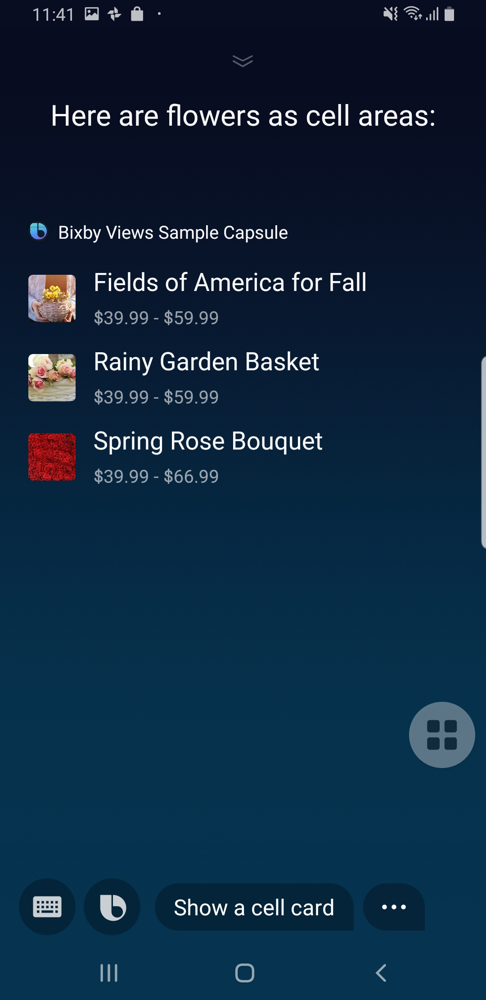 | 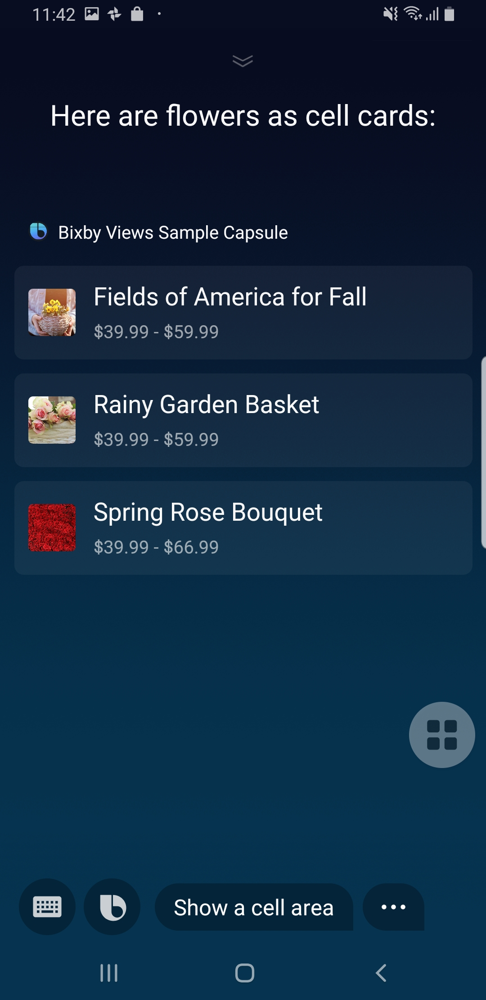 | 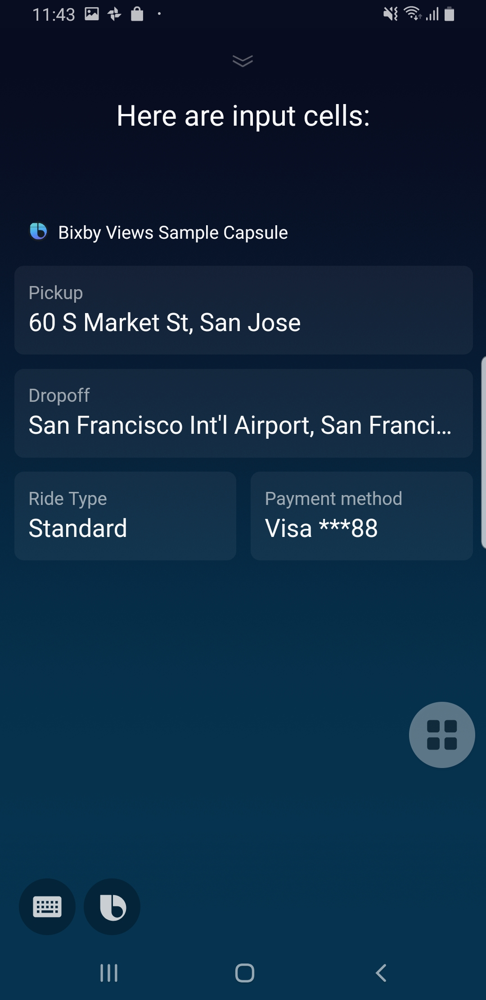 |

| nl(Show a partition) | nl(Show a map) | nl(Show a title area) | nl(Show a title card) | nl(Show an hbox) |
| --- | --- | --- | --- | --- |
| 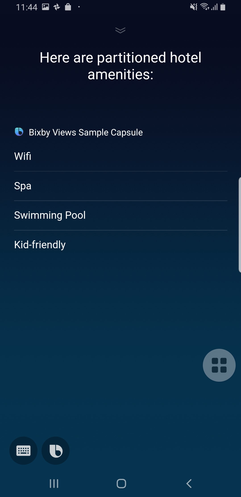 | 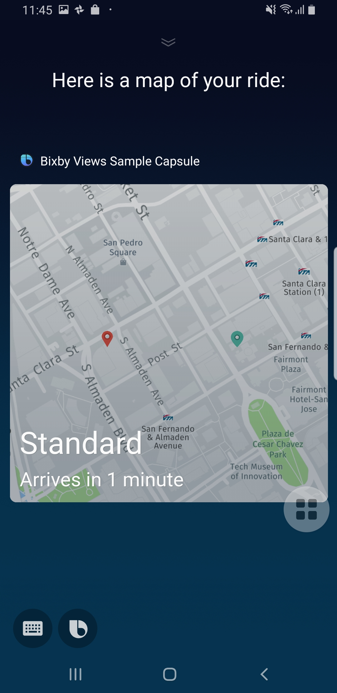 | 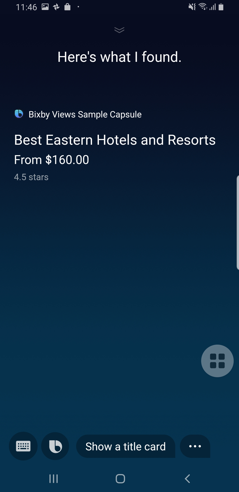 | 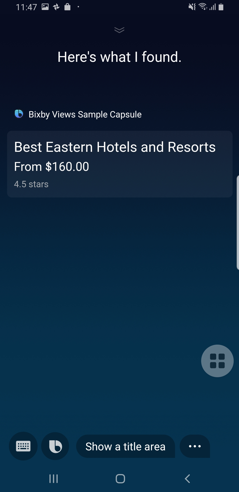 |  |

| nl(Show an image) | nl(Show a video) | nl(Show a progress bar) | nl(Show a header) |
| --- | --- | --- | --- |
| 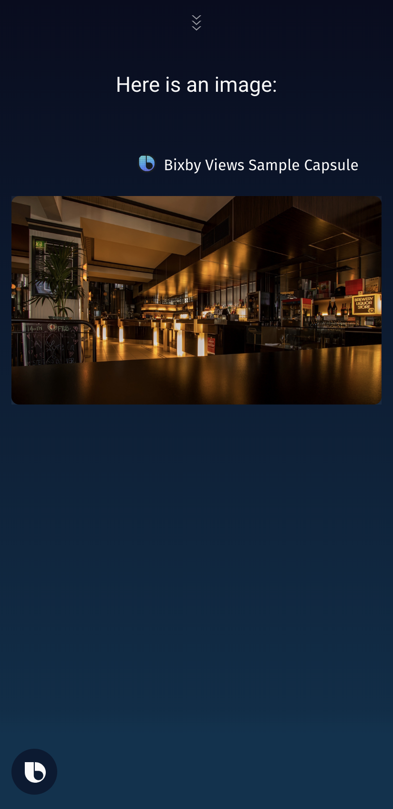 | 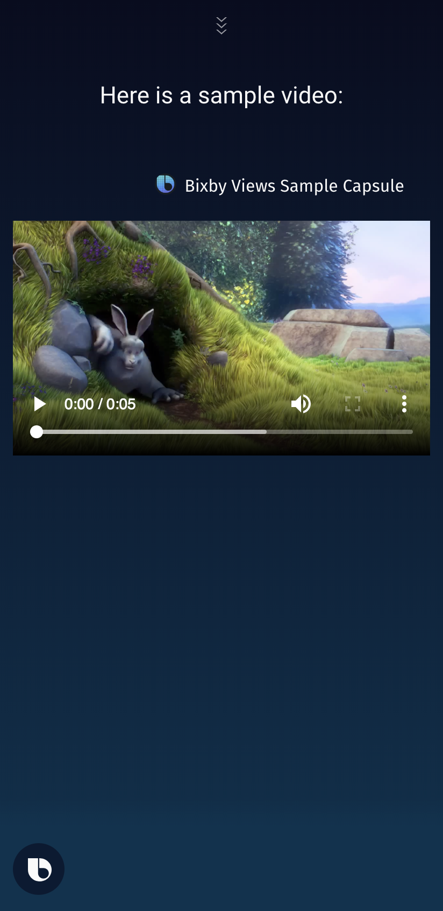 | 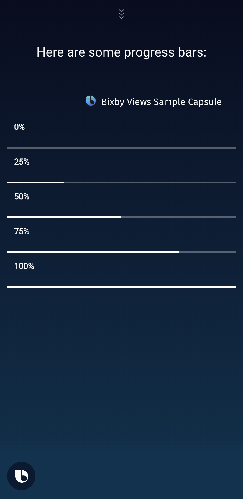 | 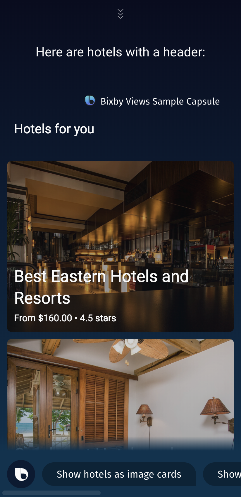 |

##

For more information see - https://bixbydevelopers.com/dev/docs/dev-guide/developers/building-views

---

## Additional Resources

### Your Source for Everything Bixby
* [Bixby Developer Center](http://bixbydevelopers.com) - Everything you need to get started with Bixby Development!

### Guides & Best Practices
* [Quick Start Guide](https://bixbydevelopers.com/dev/docs/get-started/quick-start) - Build your first capsule
* [Design Guides](https://bixbydevelopers.com/dev/docs/dev-guide/design-guides) - Best practices for designing your capsules
* [Developer Guides](https://bixbydevelopers.com/dev/docs/dev-guide/developers) - Guides that take you from design and modeling all the way through deployment of your capsules

### Video Guides
* [Introduction to Bixby](https://youtu.be/DFvpK4PosvI) - Bixby and the New Exponential Frontier of Intelligent Assistants
* [Bixby Fundamentals](https://bixby.developer.samsung.com/newsroom/en-us/22/01/2019/Teaching-Bixby-Fundamentals-What-You-Need-to-Know) - Bixby Fundamentals: What You Need to Know

### Need Support?
* Have a feature request? Please suggest it in our [Support Community](https://support.bixbydevelopers.com/hc/en-us/community/topics/360000183273-Feature-Requests) to help us prioritize.
* Have a technical question? Ask on [Stack Overflow](https://stackoverflow.com/questions/tagged/bixby) with tag “bixby”
