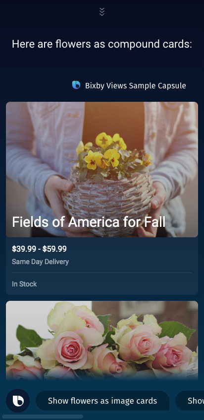
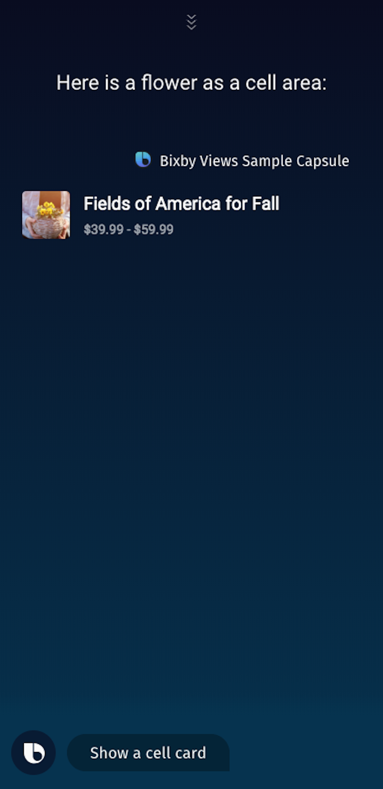
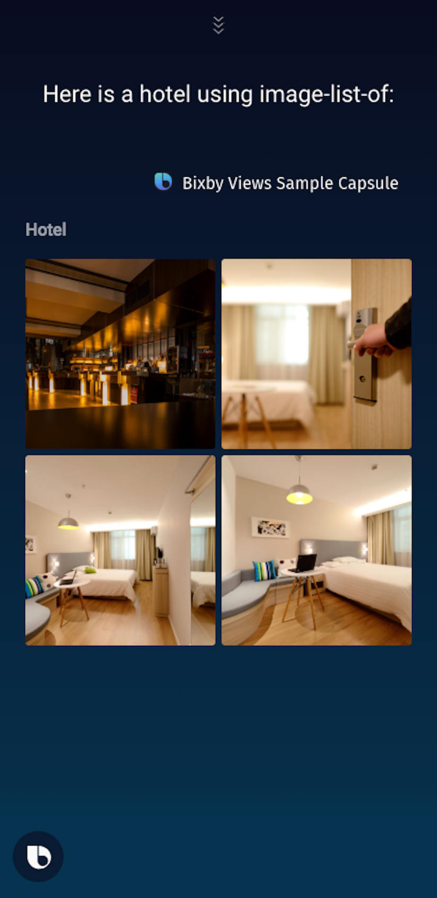
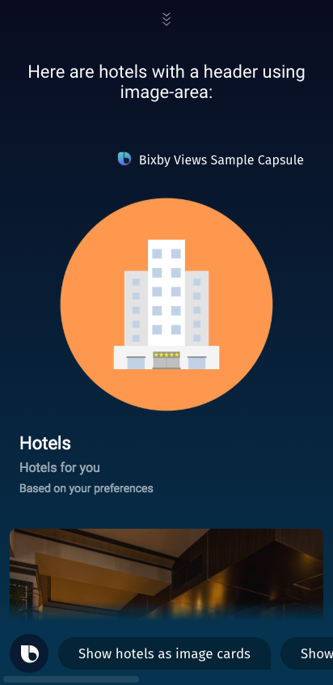
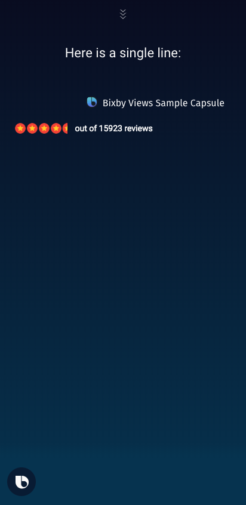
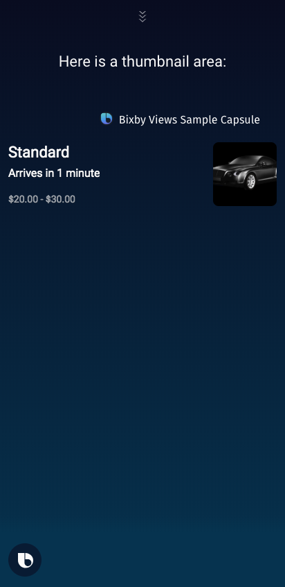

  
     
  <h1 align="Center">Bixby Views</h1>

## Usage

To see the various Bixby views components, open the simulator and run:

| Show an image card | Show a thumbnail card | Show a compound card | Show an image carousel |
| --- | --- | --- | --- |
|  |  |  |  |

| Show an image list | Show a cell area | Show a cell card | Show an input cell |
| --- | --- | --- | --- |
 |  |  |  |  |

| Show a partition | Show a map | Show a title area | Show a title card | Show an hbox |
| --- | --- | --- | --- | --- |
|  |  |  |  |  |

| Show an image | Show a video | Show a progress bar | Show a header | Show an image list of |
| --- | --- | --- | --- | --- |
|  |  |  |  |  |

| Show a header with an image area | Show a single line | Show a thumbnail area
| --- | --- | --- |
|  |  |  

##

For more information see - https://bixbydevelopers.com/dev/docs/dev-guide/developers/building-views

Be sure to use the interactive demo capabilities in the docs - this lets you change UI parameters and dynamically see the component render. Click on individual component names to use the interactive demo capabilities - https://bixbydevelopers.com/dev/docs/dev-guide/developers/building-views.components

## Tutorial Video

---

## Additional Resources

### Your Source for Everything Bixby
* [Bixby Developer Center](http://bixbydevelopers.com) - Everything you need to get started with Bixby Development!
* [Bixby News, Blogs and Tutorials](https://bixby.developer.samsung.com/) - Bixby News, Tutorials, Blogs and Events

### Guides & Best Practices
* [Quick Start Guide](https://bixbydevelopers.com/dev/docs/get-started/quick-start) - Build your first capsule
* [Design Guides](https://bixbydevelopers.com/dev/docs/dev-guide/design-guides) - Best practices for designing your capsules
* [Developer Guides](https://bixbydevelopers.com/dev/docs/dev-guide/developers) - Guides that take you from design and modeling all the way through deployment of your capsules

### Bixby Videos
* [Bixby Developers YouTube Channel](https://www.youtube.com/c/bixbydevelopers) - Tutorial videos, Presentations, Capsule Demos and more

### Bixby Podcast
* [Bixby Developers Chat](http://bixbydev.buzzsprout.com/) - Voice, Conversational AI and Bixby discussions 

### Bixby on Social Media
* [@BixbyDevelopers](https://twitter.com/bixbydevelopers) - Twitter
* [Facebook](https://facebook.com/BixbyDevelopers)
* [Instagram](https://www.instagram.com/bixbydevelopers/)

### Need Support?
* Have a feature request? Please suggest it in our [Support Community](https://support.bixbydevelopers.com/hc/en-us/community/topics/360000183273-Feature-Requests) to help us prioritize.
* Have a technical question? Ask on [Stack Overflow](https://stackoverflow.com/questions/tagged/bixby) with tag “bixby”
