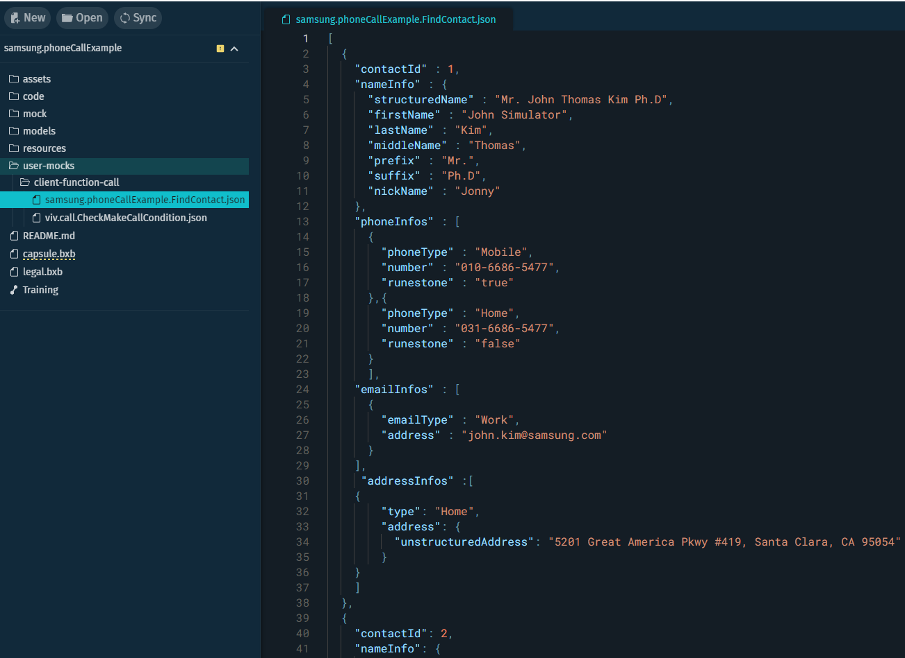
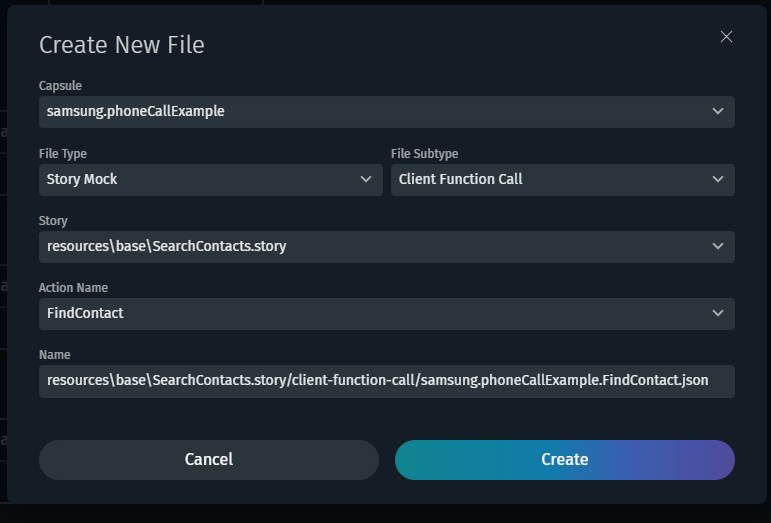

# Client Function Call Mock

The purpose of this capsule is to teach developers how to use Client Function Call mocks and Story mocks.

This example capsule was created for internal users only. If there is a newer version of `bixby.phoneCall`, feel free to update the imported capsules and update this capsule. 

The JSON mock file is a skeleton template with fields for Contacts data types. If you need to mock Client Function Calls data for testing your capsule, you need to create it with the **New File** command, the **Mock** file type, and the **Client Function Call** subtype. This will create a folder named `client-function-call` with the JSON mock file according to the Action that will be used, like in the below example.

## Usage

You can test only one endpoint.

For the **FindContact** goal, use one of these example utterances:

- "Search a Contact"
- Find Contacts"

For the **CallingInfo#Call** goal, use one of these example utterances:

- "Call"
- "Call this contact"

To see Bixby's Mock Data in action, run some of the previous example utterances.

Open the Simulator and run "Search a Contact". The contact list shown will be the same as in the file `samsung.phoneCallExample.FindContact.json`.

If you change a contact or add a new one, this should be reflected in the result contact list from the `FindContact` Goal.

You can also create a Client Function Call Story Mock to be used when running Stories in Bixby Developer Studio. The Story Mock should be created in the root folder of the story to be executed. (This is the folder the `story.yaml` file is created in when a story is saved.) To create the Mock file, right-click the Story File and select **New File** command, choose "Story Mock" as the File Type, choose the File Subtype "Client Function Calls" and the "Action Name".

Now, copy the contact information from the `samsung.phoneCallExample.FindContact.json` mock file into the new story mock file created in the Stories. The new story mock file will override the client function call only in the Stories editor validations.
___

For more information on how to use Client Function Call Mock, read the [Mock Client Function Call Mock topic](https://corp.bixbydevelopers.com/dev/docs/dev-guide/developers/testing.stories_assertions#client-function-call-mock).

## Additional Resources

### Your Source for Everything Bixby

* [Bixby Developer Center](http://bixbydevelopers.com) - Everything you need to get started with Bixby Development!

### Need Support?

* Have a feature request? Please suggest it in our [Support Community](https://support.bixbydevelopers.com/hc/en-us/community/topics/360000183273-Feature-Requests) to help us prioritize.
* Have a technical question? Ask on [Stack Overflow](https://stackoverflow.com/questions/tagged/bixby) with tag “bixby”
