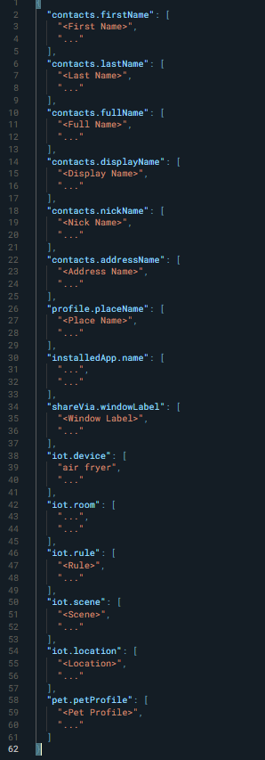
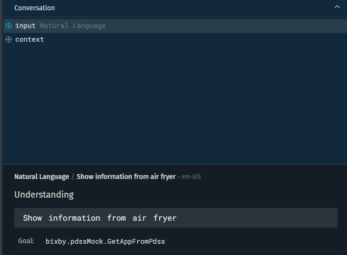
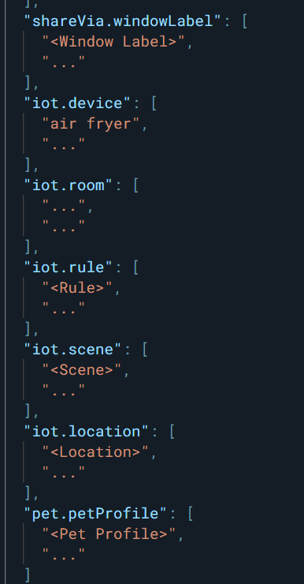
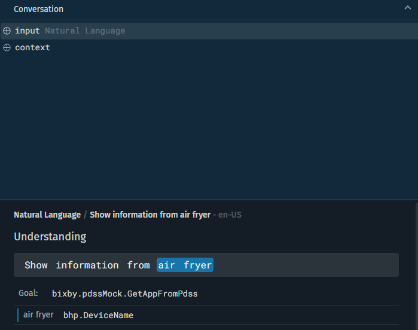

# PDSS Mock

The purpose of this capsule is to teach developers how to use PDSS mock.

This example capsule was created for internal users only. If there is a newer version of `bixby.installedApps` and `bixby.bhp`, feel free to update the imported capsules and update this capsule. 

The JSON mock file is a skeleton template with fields for common PDSS data types. If you need to mock PDSS data for testing your capsule, you need to create it with the **New File** command, the **Mock** file type, and the **PDSS Data Mocks** subtype. This will create and open a ``pdss-data-mocks.json``, like the below example.

## Usage

You can test only one endpoint.

1. Getting the installed app with PDSS:
    ___
    - This utterance tags the **bhp.DeviceName** 

   
    >
    >    Show information from *air dresser* 

    >    Find *mobile* app info
    >
    

   - This utterance tags the **bhp.RoonName** 

   
    >
    >    Find in the *living room* device 

    >    Search device in the *kitchen*
    >

   - This utterance tags the **bhp.SceneName** 

   
    >
    >    Turn on *I am home* scene 

    >    Run scene with name *living room off*
    >

   - This utterance tags the **bhp.LocationName** 

   
    >
    >   Show me the devices in *my home*
    >

To see Bixby's Mock Data in action, run some of the previous example utterances.

Open the Simulator and run "Show information from air dresser".  In the tab conversation of the Debug Console, the device `air dresser` is tagged as `bhp.deviceName`.

If you change the name of the device in the Simulator to `air fryer`, note that the device untagged.

You can also test a new device name. You can use the `pdss-data-mocks.json` to tag the `iot.device` as a `bhp.deviceName`.

Add the new device name in `iot.device` to see if it works.

After you've updated the tag, run the utterance in the Simulator again and see if the utterance is properly tagged.

This sample capsule was implemented with four IOT functionalities: `iot.device`, `iot.room`, `iot.scene` and `iot.location`

For more information on how to use PDSS Mock, read the [Mock PDSS Data topic](https://corp.bixbydevelopers.com/dev/docs/dev-guide/developers/ide.simulator#mock-pdss-data)

## Additional Resources

### Your Source for Everything Bixby
* [Bixby Developer Center](http://bixbydevelopers.com) - Everything you need to get started with Bixby Development!

### Need Support?
* Have a feature request? Please suggest it in our [Support Community](https://support.bixbydevelopers.com/hc/en-us/community/topics/360000183273-Feature-Requests) to help us prioritize.
* Have a technical question? Ask on [Stack Overflow](https://stackoverflow.com/questions/tagged/bixby) with tag “bixby”