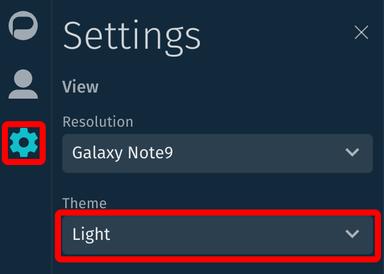
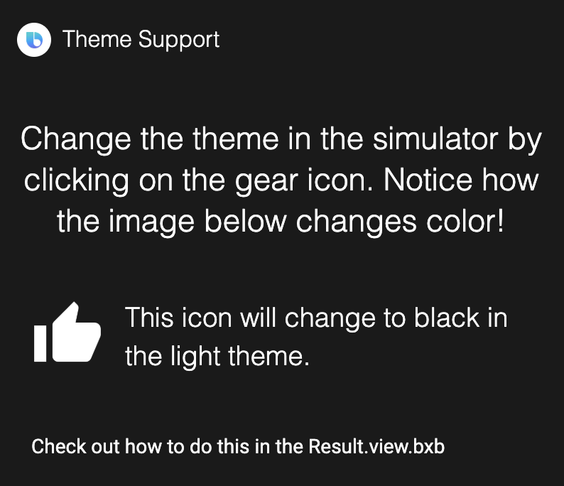
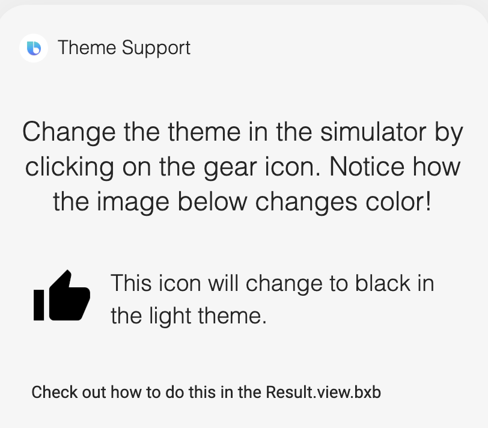

<p align="Center">
  
  <br/>
  <h1 align="Center">Bixby Theme Support</h1>
</p>

## Description

This capsule demonstrates how to change an image based on the theme.

# Usage:

Open the simulator and run `start`:

Change the theme in the simulator by clicking on the gear icon.



---

Notice how the dark theme has a white thumbs-up icon and the light theme has a black thumbs-up icon.




---

## Code Example

Check out `resources/base/views/Result.view.bxb` lines 12-18

```
image{
url("/images/icons/thumbs-up-white.png"){
    light-theme("/images/icons/thumbs-up-black.png")
  }
}
```

The `light-theme` key can be used to set an alternate image url for the light theme.

Likewise, the `dark-theme` key (not used in this example) can be used to set an alternate image url for the dark theme.

---

## Tutorial Video

[](https://youtu.be/lTeKU5iQxqk)

---

## Additional Resources

### Your Source for Everything Bixby

- [Bixby Developer Center](http://bixbydevelopers.com) - Everything you need to get started with Bixby Development!
- [Bixby News, Blogs and Tutorials](https://bixby.developer.samsung.com/) - Bixby News, Tutorials, Blogs and Events

### Guides & Best Practices

- [Quick Start Guide](https://bixbydevelopers.com/dev/docs/get-started/quick-start) - Build your first capsule
- [Design Guides](https://bixbydevelopers.com/dev/docs/dev-guide/design-guides) - Best practices for designing your capsules
- [Developer Guides](https://bixbydevelopers.com/dev/docs/dev-guide/developers) - Guides that take you from design and modeling all the way through deployment of your capsules

### Bixby Videos

- [Bixby Developers YouTube Channel](https://www.youtube.com/c/bixbydevelopers) - Tutorial videos, Presentations, Capsule Demos and more

### Bixby Podcast

- [Bixby Developers Chat](http://bixbydev.buzzsprout.com/) - Voice, Conversational AI and Bixby discussions

### Bixby on Social Media

- [@BixbyDevelopers](https://twitter.com/bixbydevelopers) - Twitter
- [Facebook](https://facebook.com/BixbyDevelopers)
- [Instagram](https://www.instagram.com/bixbydevelopers/)

### Need Support?

- Have a feature request? Please suggest it in our [Support Community](https://support.bixbydevelopers.com/hc/en-us/community/topics/360000183273-Feature-Requests) to help us prioritize.
- Have a technical question? Ask on [Stack Overflow](https://stackoverflow.com/questions/tagged/bixby) with tag “bixby”
