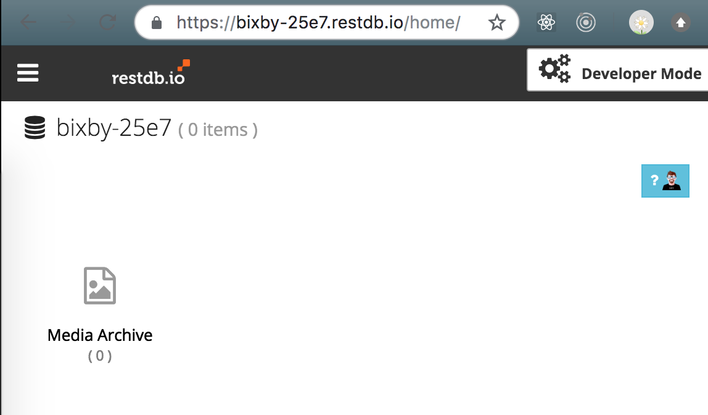
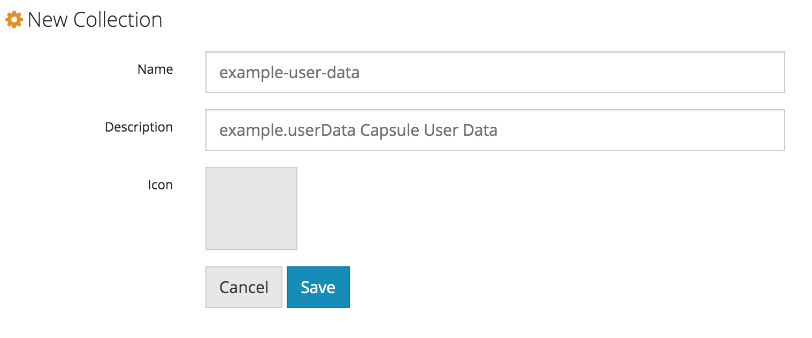
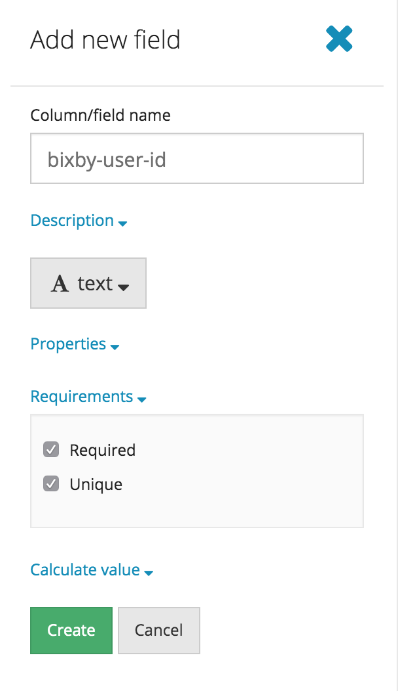
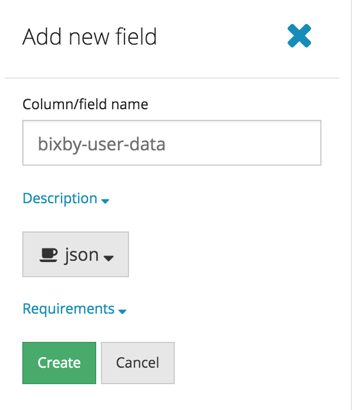
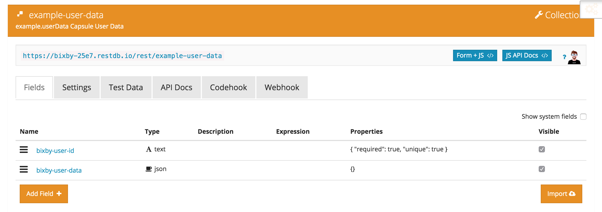

  

  <h1>Bixby User Data Persistence Sample Capsule</h1>

## Overview

This is an example capsule that demonstrates how to persist user data across conversations by performing CRUD operations on a remote database. We'll use [restdb.io][1], a simple NoSQL database backend with a free plan.

[1]: https://restdb.io 

The scenario for this capsule is to allow each user to manage an "army". The user data is the army, and consists of a single `Boss` Concept and any number of `Minion` Concepts.

## Configuring the Database

To create your own remote database with restdb.io, follow these simple steps:

* Sign up for a free account at <https://restdb.io/>.

* [Create a new Database](https://restdb.io/account/databases/) called `bixby`. Click on the database to go to its home page. Example: `https://bixby-25e7.restdb.io/home/`.

  

* Click on the top right icon with 3 gears to enter Developer Mode. Add a new Collection called `<your-capsule-name>`. Example: `example-user-data`.

  

* Click on the new Collection to configure its fields.

    - Add a `bixby-user-id` field of type **text** with requirements **Required** and **Unique** checked.
    
      

    - Add a `bixby-user-data` field of type **json**.
    
      

* That's it! Your setup should now look like this. Next you will connect and authenticate to it from the capsule.
  

## Using the Capsule

The capsule's training includes commands that match the CRUD operations: read, create, update, and delete.

### Read

Command:

    Summon my army

This will get the user data if it exists, otherwise there will be no results.

### Create/Update

Commands:

    Crown Guru as the big boss
    Enlist Kevin, Bobby and Stewart
    Conscript Noberto

This will update the user data if it exists, otherwise it will create it.

There are two values persisted:

* A property ("the big boss") with a single state that gets replaced with any incoming value.
* A property with multiple values that any incoming values are appended to.

"Enlist" takes three (and only three) values; "conscript" takes one. (Adding training and, if necessary, new concepts and actions to handle multiple values is left as an exercise.)

### Delete

Command:

    Disband my army

This will delete the user data.

## Securing with a Real Namespace

Since this capsule is in the `example` namespace, it doesn't use [dynamic configuration properties & secrets](https://bixbydevelopers.com/dev/docs/reference/ref-topics/capsule-config). Since sensitive information has to be stored with the capsule, this makes it less secure. Here's how to set it in your namespace.

* [Register your Team and Capsule](https://bixbydevelopers.com/dev/docs/dev-guide/developers/managing-caps.managing-your-team) in the Bixby Developer Center.

* [Add configs & secrets](https://bixbydevelopers.com/dev/docs/reference/ref-topics/capsule-config#config-secrets) in the Bixby Developer Center:

    - Configs:

        - `baseUrl`=`https://bixby-25e7.restdb.io/rest/`: Update this to match the URL provided at the top of your Collection Developer Tools panel, but without the collection name, which we'll add separately on the next step.
        - `collection`=`example-user-data`: Collection name from above.
        - `userIdField`=`bixby-user-id`: User id field from above.
        - `userDataField`=`bixby-user-data`: User data field from above.

    - Secrets:

        - `apiKey`=`678b16ce31cfef34e796dcefd81ea27072574`: Update this to match the Server apiKey provided in your Database Settings.

  - Click **Save**. Now your Configs & Secrets should look like this:
  
    

* Edit the capsule.bxb file to update the [`id` key](https://bixbydevelopers.com/dev/docs/reference/type/capsule.id) to match your registered capsule namespace and name.

  

* Edit the capsule.properties file to change the `capsule.config.mode` from `example` to `default`.

  

That's it! Now you can sync your capsule and try out some queries!

**Note:** You may want to repeat the setup instructions twice to have a Dev and a Prod environment.

## Limitations

This is intended for non-sensitive user data.

The deprecated `$vivContext.userId` will soon be replaced with a different key that will give users a different user id. There will be a transition period to migrate user data.

---

## Additional Resources

### Your Source for Everything Bixby

* [Bixby Developer Center](http://bixbydevelopers.com) - Everything you need to get started with Bixby Development!

### Guides & Best Practices

* [Quick Start Guide](https://bixbydevelopers.com/dev/docs/get-started/quick-start) - Build your first capsule
* [Design Guides](https://bixbydevelopers.com/dev/docs/dev-guide/design-guides) - Best practices for designing your capsules
* [Developer Guides](https://bixbydevelopers.com/dev/docs/dev-guide/developers) - Guides that take you from design and modeling all the way through deployment of your capsules

### Video Guides

* [Introduction to Bixby](https://youtu.be/DFvpK4PosvI) - Bixby and the New Exponential Frontier of Intelligent Assistants
* [Bixby Fundamentals](https://bixby.developer.samsung.com/newsroom/en-us/22/01/2019/Teaching-Bixby-Fundamentals-What-You-Need-to-Know) - Bixby Fundamentals: What You Need to Know

### Need Support?

* Have a feature request? Please suggest it in our [Support Community](https://support.bixbydevelopers.com/hc/en-us/community/topics/360000183273-Feature-Requests)!
* Have a technical question? Ask on [Stack Overflow](https://stackoverflow.com/questions/tagged/bixby) with the tag “bixby”.
