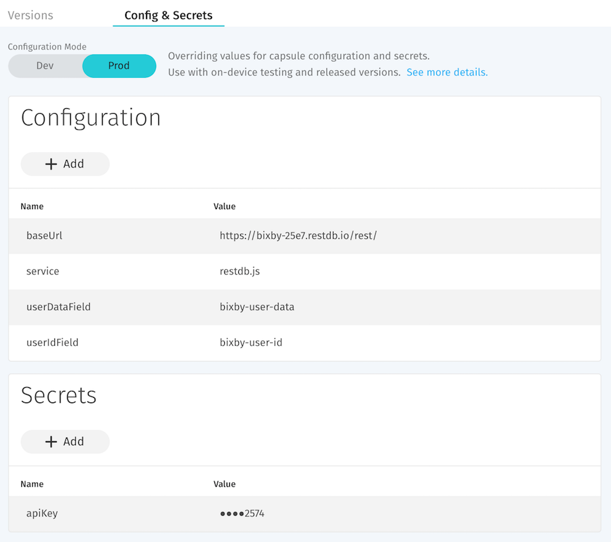
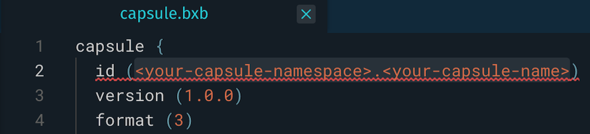
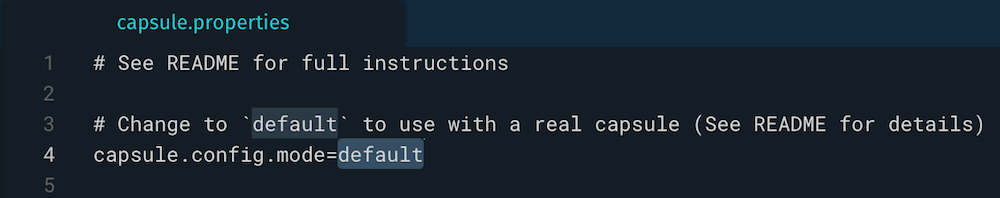

  
   
  <h1 align="Center">Bixby User Data Persistence Sample Capsule</h1>

## Overview

This is an example Capsule that demonstrates how to save data for each user.
It allows user data to persist across conversations by performing CRUD operations on a remote database.

The scenario for this capsule is to allow each user to manage an "army". The user data is the army and consists of a single `Boss` Concept and any number of `Minion` Concepts.

### Capsule Usage

#### READ

This will get the user data if it exists, otherwise there will be no results. `nl("Summon my army")`

#### CREATE/UPDATE

This will update the user data if it exists, otherwise it will create it. We demonstrate 2 types of persistence:
- A property with a single state that gets replaced with any incoming value. `nl("Crown Guru as the big boss")`
- A property with multiple values that get appended with any incoming value(s). `nl("Enlist Kavin, Bobby and Stewart")` followed by `nl("Conscript Norberto")` will result in an army of 4 minions.

#### DELETE

This will delete the user data. `nl("Disband my army")`

### Setup Instructions

This sample capsule allows you to choose the service you would like to use to
store your user data. Currently, the supported services are
[restDB](https://restdb.io) and [Airtable](https://airtable.com). Both of these
offer a generous free tier and are easy to setup. We have test accounts
already up and running that you can use to try them out live. Simply update the
`capsule.properties` file `capsule.config.mode` to `exampleRestDB` or
`exampleAirtable` respectively. Then try some of the capsule queries defined
in the Capsule Usage section above.

Since this capsule is in the `example` namespace, it doesn't use [dynamic
Config &
Secrets](https://bixbydevelopers.com/dev/docs/reference/ref-topics/capsule-config). To setup with a real namespace and keep your data secure:
- Select a service and follow the corresponding instructions:
  - [Integration walk-through for restDB](./restDB.md)
  - [Integration walk-through for Airtable](./airtable.md)
- [Register your Team and Capsule](https://bixbydevelopers.com/dev/docs/dev-guide/developers/managing-caps.managing-your-team) in the Bixby Developer Center
- [Add configs & secrets](https://bixbydevelopers.com/dev/docs/reference/ref-topics/capsule-config#config-secrets) in the Bixby Developer Center. Use the field names and values provided in the integration walk-throughs for your selected service. Hit the Save button. Now your Configs & Secrets should look like this: 
- Edit the `capsule.bxb` file to update the [`id` key](https://bixbydevelopers.com/dev/docs/reference/type/capsule.id) to match your registered capsule namespace and name 
- Edit the `capsule.properties` file to change the `capsule.config.mode` from example to `default` 

That's it! Now you can sync your capsule and try out some queries!

**Note:** You may want to repeat the setup instructions twice to have a Dev and a Prod environment.

### Limitations

This is intended for non-sensitive user data.

---

## Additional Resources

### Your Source for Everything Bixby
* [Bixby Developer Center](http://bixbydevelopers.com) - Everything you need to get started with Bixby Development!

### Guides & Best Practices
* [Quick Start Guide](https://bixbydevelopers.com/dev/docs/get-started/quick-start) - Build your first capsule
* [Design Guides](https://bixbydevelopers.com/dev/docs/dev-guide/design-guides) - Best practices for designing your capsules
* [Developer Guides](https://bixbydevelopers.com/dev/docs/dev-guide/developers) - Guides that take you from design and modeling all the way through deployment of your capsules

### Video Guides
* [Introduction to Bixby](https://youtu.be/DFvpK4PosvI) - Bixby and the New Exponential Frontier of Intelligent Assistants
* [Bixby Fundamentals](https://bixby.developer.samsung.com/newsroom/en-us/22/01/2019/Teaching-Bixby-Fundamentals-What-You-Need-to-Know) - Bixby Fundamentals: What You Need to Know

### Need Support?
* Have a feature request? Please suggest it in our [Support Community](https://support.bixbydevelopers.com/hc/en-us/community/topics/360000183273-Feature-Requests) to help us prioritize.
* Have a technical question? Ask on [Stack Overflow](https://stackoverflow.com/questions/tagged/bixby) with tag “bixby”
