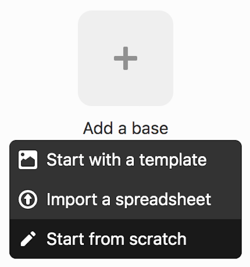
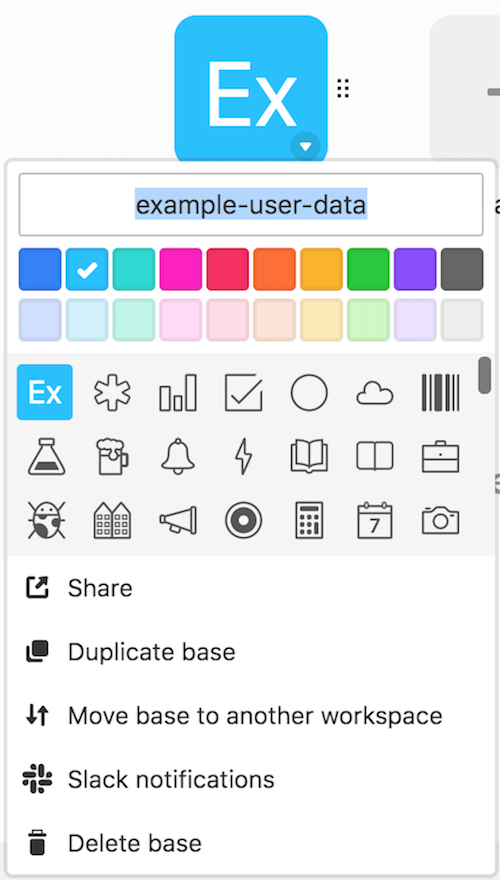
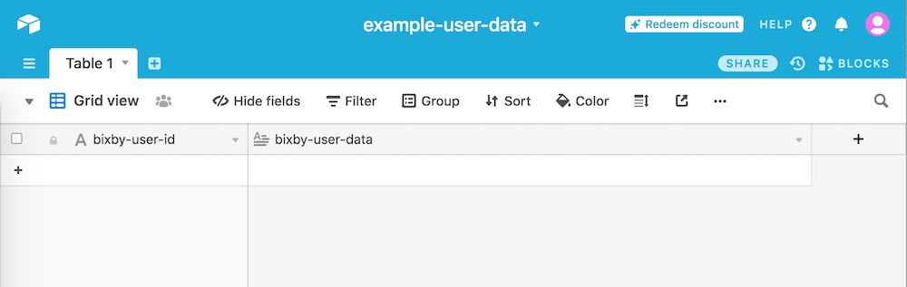

# Airtable

Airtable is a service which allows developers to create a cloud-hosted spreadsheet exposed through a REST API.

To try it out using the provided test account, edit the `capsule.properties` file
to include `capsule.config.mode=exampleAirtable`.

#### Remote Database Setup

- Sign up for a free Airtable account at https://airtable.com/
- Create a new Workspace called `bixby`.
- Click "Add a base" > "Start from scratch". Change the name to `<your-capsule-name>`. Example: `example-user-data`

  

  

- Click on the new Base to configure the table
  - The first column is the required and unique [primary field](https://support.airtable.com/hc/en-us/articles/202624179-The-Name-Field) that we will use for the bixby user ids. Click on the header dropdown arrow to edit it. Leave the default type unchanged (Single line text) and rename the field. Example: `bixby-user-id`
  - Edit the second column to hold the bixby user data. Customize the field type to "Long text" and rename it. Example: `bixby-user-data`
  - Delete any other columns (right-click > "Delete field")
  - Delete all row records (right-click > "Delete record")
- Your setup should now look like this and is ready to be connected to the capsule. 
- Follow the instructions in the [main README](./README.md) and insert the
following values when requested.
  - Configs
  ```
  service=airtable.js
  baseUrl=https://api.airtable.com/v0/appj3vi1PtX4Q9CqP/Table%201 // Update this to match the url provided in the docs for your new Workspace and Base at https://airtable.com/api
  userIdField=bixby-user-id // User id field from above
  userDataField=bixby-user-data // User data field from above
  ```
  - Secrets
  ```
  apiKey=keypIplWmQs8liVl1 // Update this to match the api key from your account page > API > "Generate API key"
  ```
