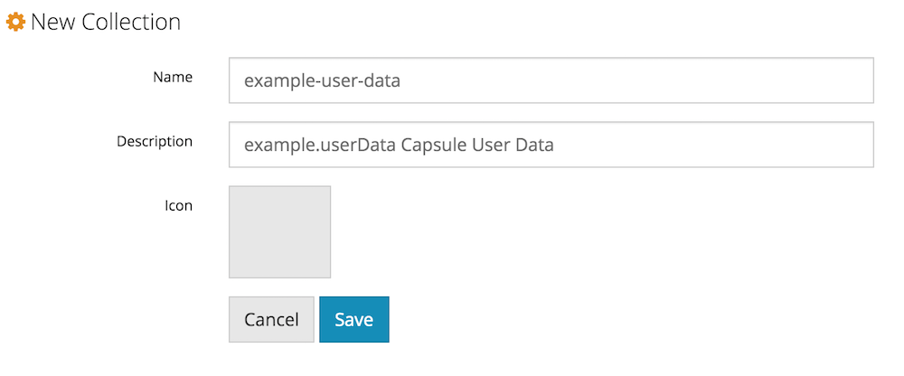
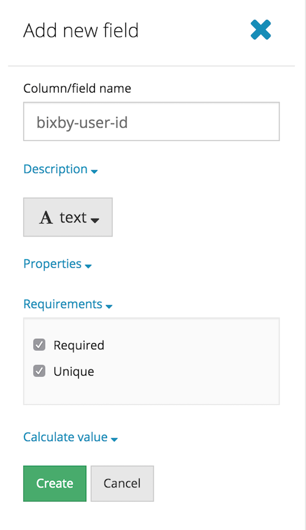
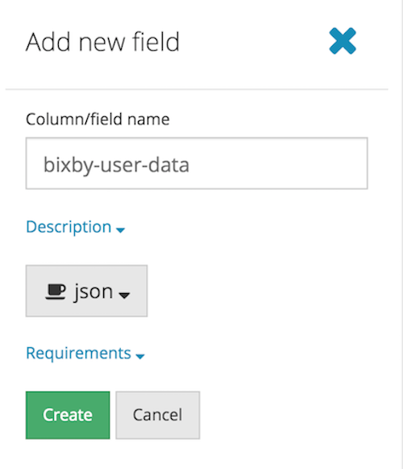
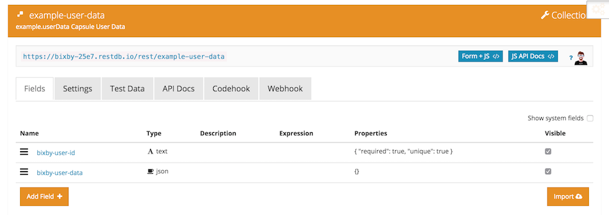

## RestDB

RestDB is a service which allows developers to create a cloud hosted noSQL database exposed through a REST API.

#### Remote Database Setup

To create your own remote database, follow these simple steps:

- Sign up for a free restDB account at https://restdb.io/
- [Create a new Database](https://restdb.io/account/databases/) called `bixby`. Click on the database to go to its home page. Example: https://bixby-25e7.restdb.io/home/ 
- Click on the top right icon with 3 gears to enter Developer Mode. Add a new Collection called `<your-capsule-name>`. Example: `example-user-data` 
- Click on the new Collection to configure its Fields.
  - Add Field for user id of type Text with Requirements Required and Unique. Example: `bixby-user-id` 
  - Add Field for user data of type json. Example: `bixby-user-data` 
- That's it! Your setup should now look like this. Next you will connect and authenticate to it from the capsule. 

#### Dynamic Properties Setup

- Configs:
  - `baseUrl`=`https://bixby-25e7.restdb.io/rest/example-user-data`: Update this to match the url provided at the top of your Collection Developer Tools panel
  - `userIdField`=`bixby-user-id`: User id field from above
  - `userDataField`=`bixby-user-data`: User data field from above
- Secrets:
  - `apiKey`=`678b16ce31cfef34e796dcefd81ea27072574`: Update this to match the Server apiKey provided in your Database Settings
